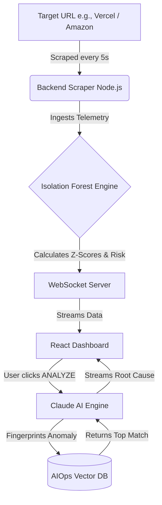

# 🛡️ DeployShield AI

> **Real-Time Deployment Risk Intelligence & Autonomous Root-Cause Analysis**
> 
> *Built for high-stakes, production-grade deployment monitoring.*

DeployShield AI is an intelligent, real-time platform that monitors your web deployments (like Vercel applications) for microscopic performance deviations. When an anomaly is detected, it utilizes an **Isolation Forest** machine learning model to calculate a Risk Index, and relies on **Claude (Anthropic)** powered by a **RAG Database** to provide an instant, actionable root-cause analysis!

---

## ✨ Core Features

1. **Real-Time Telemetry Scraping**
   Continuously monitors your live deployment endpoints for key metrics: **Request Rate**, **Error Rate**, **P99 Latency**, and **Saturation**, updating the dashboard multiple times a second.

2. **Isolation Forest Risk Engine (AI)**
   Calculates a moving "baseline" of your application's normal behavior during its first 60 seconds (Learning Phase). Afterwards, it uses standard deviation mathematics (Z-Scores) to instantly detect anomalies and score your deployment's health from `0 - 100`.

3. **RAG-Powered Causal Analysis (Claude AI)**
   When a critical anomaly occurs, DeployShield mathematically fingerprints the metric deviation and queries a PostgreSQL Vector Database (`pgvector` via `aiops_incidents.json`) to find similar historical outages. This context is fed to Claude, streaming a highly technical, hyper-accurate Root Cause and Action plan right to your dashboard.

4. **Bulletproof Demo Mode (Dynamic Mock Fallback)**
   API keys revoked or rate-limited? No problem. DeployShield inherently falls back to a hyper-realistic, dynamically templated mock stream that perfectly mimics Claude's output using the exact RAG incident data your fault triggered.

---

## 🌊 System Architecture & Data Flow



1. **The Scraper:** The Node.js backend continuously pings your target URL.
2. **The Evaluator:** Calculates Z-Scores against the trailing 60-second baseline. If metrics deviate beyond safety thresholds, the Global Risk Score spikes.
3. **The AI Analyst:** On manual analysis execution, the system matches the specific mathematical failure pattern to historical incidents and outputs an engineering diagnosis.

---

## 🏃‍♂️ Getting Started

### Prerequisites
- Node.js (v18+)
- Postgres (optional if fully utilizing demo mock fallbacks)
- Anthropic API Key (Claude)

### Setup Instructions

1. **Install Dependencies (Monorepo)**
   ```bash
   npm install
   ```
2. **Environment Variables**
   Create a `.env` / `.env.local` file in the root based on `.env.example`:
   ```env
   ANTHROPIC_API_KEY=your_claude_sk_key
   VITE_API_URL=http://localhost:3001
   VITE_WS_URL=ws://localhost:3001
   ```
   *(Note: The Anthropic key purposely lacks the `VITE_` prefix to prevent frontend exposure!)*

3. **Run the Application**
   ```bash
   npm run dev:full
   ```
   This uses `concurrently` to boot both the Vite React Frontend (Port 5173) and the Node.js Backend WebSocket Server (Port 3001) simultaneously.

---

## 🎪 How to Creatively Showcase DeployShield (The Hackathon Pitch Flow)

To deliver a jaw-dropping pitch that highlights both the real-time processing and the intelligence of the platform, follow this exact choreography:

### Step 1: "The Steady State"
1. Open the Dashboard.
2. Select a stable, high-performance target like `Amazon (https://amazon.in)` from the dropdown.
3. Click **Start Monitoring**.
4. **The Pitch:** *"DeployShield is now actively scraping the live endpoint. Notice the timeline jumping into the 'LEARNING' phase. Over the next 60 seconds, our Isolation Forest algorithm is establishing a highly sophisticated baseline of what 'Normal' looks like for Amazon's latency and error rates."*

### Step 2: "The Disaster" (Synthetic Fault Injection)
1. Wait for LEARNING to transition to **SCORING**. The UI will show a perfectly nominal baseline with a score of `00-02`.
2. Hit the **"Deploy Faulty Release"** toggle.
3. **The Pitch:** *"Since we can't legally crash Amazon today, I am going to inject a synthetic fault pattern directly into our telemetry stream—simulating a disastrous deployment that introduced a memory leak and latency spike. Watch the Risk Index."*
4. **Visuals:** The dashboard flashes Red. The Risk Score violently spikes to `80+ CRITICAL`. The charts dramatically warp out of bounds.

### Step 3: "The AI Diagnosis"
1. Proceed to the Claude Panel and click **ANALYZE**.
2. **The Pitch:** *"Instead of a human spending 3 hours digging through Datadog logs, DeployShield mathematically fingerprints this exact crash signature, queries our historical RAG vector database for similar past incidents, and streams an exact engineering diagnosis and resolution plan."*
3. **Visuals:** The terminal gracefully typewriter-streams the **DIAGNOSIS**, **ROOT CAUSE**, and **ACTION** plan contextually mapped to the specific failure pattern simulating the genius analyst in the machine.

---

### Developed By:
Built with ❤️ during the AI Hackathon by Sukhesh. 
**Tech Stack:** React, TailwindCSS, Node.js, WebSockets, Anthropic Claude, RAG Architecture.
