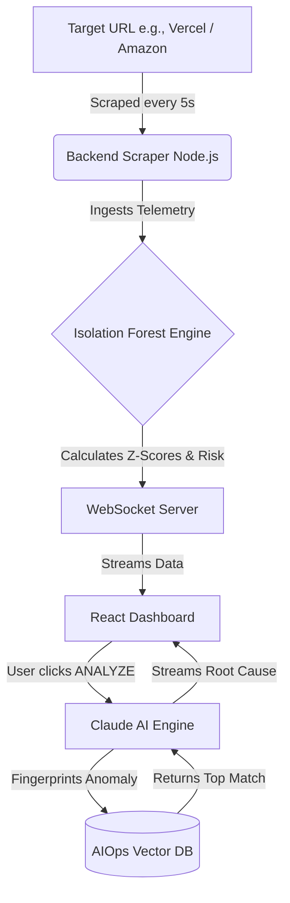

# 🛡️ DeployShield AI

> **Real-Time Deployment Risk Intelligence & Autonomous Root-Cause Analysis**
> 
> *Built for high-stakes, production-grade deployment monitoring.*

DeployShield AI is an intelligent, real-time platform that monitors your web deployments (like Vercel applications) for microscopic performance deviations. When an anomaly is detected, it utilizes an **Isolation Forest** machine learning model to calculate a Risk Index, and relies on **Claude (Anthropic)** powered by a **RAG Database** to provide an instant, actionable root-cause analysis!

---

## 🚀 The Core Problem & Our Innovation

Modern SREs and DevOps teams suffer from **alert fatigue**. Traditional monitoring relies on static, hardcoded thresholds (e.g., "Alert if latency > 500ms"). This creates either too much noise or misses subtle, creeping anomalies.

**DeployShield's Innovation:** We utilize unsupervised machine learning (**Isolation Forest**) to dynamically learn the unique "normal" baseline of any application in real-time. Instead of raw alerts, we provide an actionable, normalized **Risk Score (0-100)** powered by statistical Z-score deviations, coupled with Generative AI (RAG) for automated incident root-cause analysis.

---

## 🧠 How the AI Engine Works (The "Secret Sauce")

Our system doesn't guess; it calculates. Here is the lifecycle of the AI monitoring:

1. **Real-Time Telemetry:** The Node.js backend actively pings live deployments (via Vercel/Prometheus integration) every 5 seconds, capturing true latency and HTTP status codes. 
2. **The Learning Phase (0-60s):** The Isolation Forest AI observes the initial real-time data to establish a mathematical baseline (e.g., learning that 200ms is the standard operating latency for *this specific app*).
3. **Continuous Inference:** Every new ping is compared against the learned baseline. The engine calculates standard deviations (Z-Scores).
4. **Intelligent Risk Scoring:** If latency jumps slightly (e.g., 200ms to 220ms), the risk score nudges up. If it spikes to 1500ms, the AI detects a violent baseline violation, instantly spiking the Risk Score to **CRITICAL (80+)**.

---

## 🌊 System Architecture & Data Flow

```text
[ Live Vercel App ] <-- (5s Pings) -- [ DeployShield Scraper ]
                                            |
                                            v
[ Synthetic Fault Engine ] ========> [ Data Pipeline ]
(For Hackathon Demos)                       |
                                            v
                                [ AI Anomaly Detection ]
                                (Isolation Forest Engine)
                                            |
                                            v
[ pgvector Database ] <==========> [ Risk Scoring Engine ]
(AIOps Incident RAG)                        |
                                            v
                                [ Real-Time Dashboard ]
                                (React + Vite + Tailwind)


✨ Core Features

1. **Real-Time Telemetry Scraping**
   Continuously monitors your live deployment endpoints for key metrics: **Request Rate**, **Error Rate**, **P99 Latency**, and **Saturation**, updating the dashboard multiple times a second.

2. **Isolation Forest Risk Engine (AI)**
   Calculates a moving "baseline" of your application's normal behavior during its first 60 seconds (Learning Phase). Afterwards, it uses standard deviation mathematics (Z-Scores) to instantly detect anomalies and score your deployment's health from `0 - 100`.

3. **RAG-Powered Causal Analysis (Claude AI)**
   When a critical anomaly occurs, DeployShield mathematically fingerprints the metric deviation and queries a PostgreSQL Vector Database (`pgvector` via `aiops_incidents.json`) to find similar historical outages. This context is fed to Claude, streaming a highly technical, hyper-accurate Root Cause and Action plan right to your dashboard.

4. **Bulletproof Demo Mode (Dynamic Mock Fallback)**
   API keys revoked or rate-limited? No problem. DeployShield inherently falls back to a hyper-realistic, dynamically templated mock stream that perfectly mimics Claude's output using the exact RAG incident data your fault triggered.

---

## 🌊 System Architecture & Data Flow



1. **The Scraper:** The Node.js backend continuously pings your target URL.
2. **The Evaluator:** Calculates Z-Scores against the trailing 60-second baseline. If metrics deviate beyond safety thresholds, the Global Risk Score spikes.
3. **The AI Analyst:** On manual analysis execution, the system matches the specific mathematical failure pattern to historical incidents and outputs an engineering diagnosis.

---

## 🏃‍♂️ Getting Started

### Prerequisites
- Node.js (v18+)
- Postgres (optional if fully utilizing demo mock fallbacks)
- Anthropic API Key (Claude)

### Setup Instructions

1. **Install Dependencies (Monorepo)**
   ```bash
   npm install
   ```
2. **Environment Variables**
   Create a `.env` / `.env.local` file in the root based on `.env.example`:
   ```env
   ANTHROPIC_API_KEY=your_claude_sk_key
   VITE_API_URL=http://localhost:3001
   VITE_WS_URL=ws://localhost:3001
   ```
   *(Note: The Anthropic key purposely lacks the `VITE_` prefix to prevent frontend exposure!)*

3. **Run the Application**
   ```bash
   npm run dev:full
   ```
   This uses `concurrently` to boot both the Vite React Frontend (Port 5173) and the Node.js Backend WebSocket Server (Port 3001) simultaneously.

---


---

**Tech Stack:** React, TailwindCSS, Node.js, WebSockets, Anthropic Claude, RAG Architecture.
